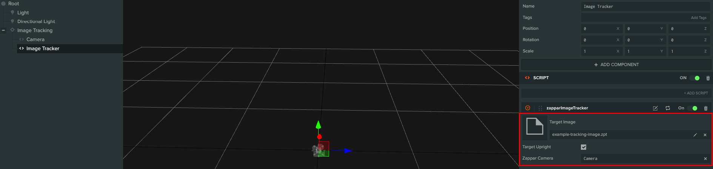
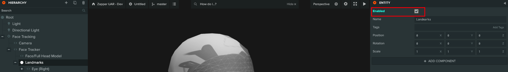

# Zappar for PlayCanvas


This project lets you use Zappar's best-in-class AR technology with the PlayCanvas WebGL game engine. The library provides high performance (30 frames-per-second) face, image and world tracking for AR experiences, running in the browsers already installed on your users' mobile phones.

If you would like more information on customizing the scripts and underlying behaviors, please refer to zappar-js documentation found on our [documentation site](https://docs.zap.works/universal-ar/javascript/pipelines-and-camera-processing/) or on npm [@zappar/zappar](https://www.npmjs.com/package/@zappar/zappar).


You may also be interested in:

- Zappar for A-Frame ([website](https://zap.works/universal-ar/aframe/), [NPM](https://www.npmjs.com/package/@zappar/zappar-aframe))
- Zappar for ThreeJS ([website](https://zap.works/universal-ar/playcanvas/))
- Zappar for React+three.js ([website](https://zap.works/universal-ar/react/), [NPM](https://www.npmjs.com/package/@zappar/zappar-react-three-fiber))
- Zappar for Unity ([website](https://zap.works/universal-ar/unity/))
- Zappar for JavaScript ([website](https://zap.works/universal-ar/aframe/), [NPM](https://www.npmjs.com/package/@zappar/zappar)), if you'd like to build content with a different 3D rendering platform
- ZapWorks Studio ([website](https://zap.works/studio/)), a full 3D development environment built for AR, VR and MR

## Table Of Contents

<details>
<summary>Click to expand table of contents</summary>

<!--ts-->
   * [Zappar for PlayCanvas](#zappar-for-playcanvas)
      * [Table Of Contents](#table-of-contents)
      * [Getting Started](#getting-started)
         * [Templates](#templates)
         * [Example Projects](#example-projects)
      * [Tracking Types](#tracking-types)
         * [Image Tracking](#image-tracking)
            * [Events](#events)
         * [Face Tracking](#face-tracking)
            * [Model](#model)
               * [Events](#events-1)
               * [Head Masking](#head-masking)
            * [Events](#events-2)
            * [Face Landmarks](#face-landmarks)
         * [Instant World Tracking](#instant-world-tracking)
            * [Placement Mode](#placement-mode)
               * [Button Element](#button-element)
               * [PlayCanvas Events](#playcanvas-events)
         * [Camera](#camera)
            * [Mirror Mode](#mirror-mode)
            * [Camera Pose](#camera-pose)
            * [Snapshot &amp; Social Sharing](#snapshot--social-sharing)
      * [Compatibility and Browser Support](#compatibility-and-browser-support)
         * [Detecting Browser Compatibility](#detecting-browser-compatibility)
            * [Browser Compatibility](#browser-compatibility)
            * [Mobile Only](#mobile-only)
         * [Permissions](#permissions)
            * [Events](#events-3)
      * [Local Preview and Testing](#local-preview-and-testing)
      * [Hosting and Publishing Content](#hosting-and-publishing-content)
         * [Licensing](#licensing)
         * [ZapWorks Hosting](#zapworks-hosting)
         * [Self-hosting](#self-hosting)
         * [PlayCanvas Hosting](#playcanvas-hosting)
      * [Advanced Usage](#advanced-usage)
         * [Universal AR](#universal-ar)
         * [PlayCanvas](#playcanvas)
      * [Links and Resources](#links-and-resources)

<!-- Added by: zapparadmin, at: Mon Jul 19 15:08:17 BST 2021 -->

<!--te-->
</details>

## Getting Started

You can use this library by forking the project from PlayCanvas:
<https://playcanvas.com/project/742337/overview/zappar-universal-ar--playcanvas>


### Templates

Once you have forked the project and opened the editor, the first step is to add a template into your scene. Just drag any of the tracker templates into the scene from your project's assets. You can find Templates in your project's Assets folder, `/Zappar/Templates`.


Once imported, the relevant objects will be added to your hierarchy.

Here's what imported `Face Tracker Template` looks like:


### Example Projects

We have a number of free example projects created using these different tracking templates, coupled with other PlayCanvas specific functionality. You can view and fork them here:

<details>
<summary>Click to expand example projects</summary>

- <https://playcanvas.com/project/784792/overview/face-tracking--cannon-game>
- <https://playcanvas.com/project/788001/overview/instant-tracking--touch-control>
- <https://playcanvas.com/project/789082/overview/image-tracking--whack-a-mole>

</details>

## Tracking Types

The Zappar library offers three types of tracking templates for you to use to build augmented reality experiences:

- *Image Tracking* can detect and track a flat image in 3D space. This is great for building content that's augmented onto business cards, posters, magazine pages, etc.
- *Face Tracking* detects and tracks the user's face. You can attach 3D objects to the face itself, or render a 3D mesh that's fit to (and deforms with) the face as the user moves and changes their expression. You could build face-filter experiences to allow users to try on different virtual sunglasses, for example, or to simulate face paint.
- *Instant World Tracking* lets you tracking 3D content to a point chosen by the user in the room or immediate environment around them. With this tracking type you could build a 3D model viewer that lets users walk around to view the model from different angles, or an experience that places an animated character in their room.

### Image Tracking

The Image Tracker template lets you attach 3D content to an image. It's great for putting 3D content onto posters, business cards, flyers etc. Once you've dragged the template into your hierarchy, you'll have to set the 'Target' attribute to the 'target file' of the image you'd like to track. This file contains everything the Zappar library needs to detect and track the image in 3D space. You can generate them using the [ZapWorks command-line tool](https://www.npmjs.com/package/@zappar/zapworks-cli) like this:

```bash
zapworks train myImage.png
```



#### Events

Events are fired from `this.app`. You may listen for image tracker events like this:

```ts
this.app.on('zappar:image_tracker', (ev) => {});
```

The callback object contains a `message` property which stores the event type. The following event messages are available:

```ts
this.app.on('zappar:image_tracker', (ev) => {

  switch(ev.message){
    /**
    * Fired when the target image (.zpt) is loaded.
    */
    case 'target_loaded': break;

    /**
    * Fired when a new anchor is created by the tracker.
    */
    case 'new_anchor': console.log(ev.anchor); break;

    /**
    * Fired when an anchor becomes visible in a camera frame.
    */
    case 'anchor_visible': console.log(ev.anchor); break;

    /**
    * Fired when an anchor goes from being visible in the previous camera frame,
    * to not being visible in the current frame.
    */
    case 'anchor_not_visible': console.log(ev.anchor); break;
  }

});
```

### Face Tracking

Dragging the Face Tracker template into your hierarchy allows you to place 3D content that's tracked to the user's head. It's ideal for building face filter experiences where users wear AR hats, glasses etc. Once the Template is in place in your hierarchy, place 3D objects as children of that template for them to be tracked from the center of the user's head.


#### Model

The Face Mesh provides a 3D mesh that fits with the user's face as their expression changes and their head moves. It exposes a Face Material parameter that can be set to any valid material (a UV map is provided that aids in development). Each of the Fill* options determine whether or not the relevant portion of the mesh is 'filled' when it is rendered.


A Zappar Face Mesh requires a Zappar Face Tracker instance as its "Face Tracker" property (in the attributes). The Face Mesh can appear anywhere in the scene hierarchy, however you should place it as a child of the Face Tracker if you wish for the mesh to appear correctly attached to the face.

##### Events

The face mesh fires an event when it has loaded. You may listen for it like this:

```ts
this.app.on('zappar:face_mesh', (ev) => {
  if(ev.message === 'mesh_loaded'){
    // Mesh has loaded.
  }
});
```

##### Head Masking

If you're placing a 3D model around the user's head, such as a helmet, it's important to make sure the camera view of the user's real face is not hidden by the back of the model. To achieve this, the head mesh provides a `mask` attribute. It fills the depth buffer but not the color buffer.

#### Events

Events are fired from `this.app`. You may listen for face tracker events like this:

```ts
this.app.on('zappar:face_tracker', (ev) => {});
```

The callback object contains a `message` property which stores the event type. The following event messages are available:

```ts
this.app.on('zappar:face_tracker', (ev) => {

  switch(ev.message){
    /**
    * Fired when the face tracking model is loaded.
    */
    case 'model_loaded': break;

    /**
    * Fired when a new anchor is created by the tracker.
    */
    case 'new_anchor': console.log(ev.anchor); break;

    /**
    * Fired when an anchor becomes visible in a camera frame.
    */
    case 'anchor_visible': console.log(ev.anchor); break;

    /**
    * Fired when an anchor goes from being visible in the previous camera frame,
    * to not being visible in the current frame.
    */
    case 'anchor_not_visible': console.log(ev.anchor); break;
  }

});
```

#### Face Landmarks

In addition to tracking the center of the head, you can use `FaceLandmark`s to track content from various points on the user's face. These landmarks will remain accurate, even as the user's expression changes.


To track a landmark, simply enable the face landmarks in the hierarchy and child any content to the required landmark.



The following landmarks are available: `EYE_LEFT`, `EYE_RIGHT`, `EAR_LEFT`, `EAR_RIGHT`, `NOSE_BRIDGE`, `NOSE_TIP`, `NOSE_BASE`, `LIP_TOP`, `LIP_BOTTOM`, `MOUTH_CENTER`, `CHIN`, `EYEBROW_LEFT`, and `EYEBROW_RIGHT`. Note that 'left' and 'right' here are from the user's perspective.

### Instant World Tracking

Instant world tracking refers to the ability to attach content to a point in the world, without using a tracking image or marker. You do not need to specify any properties to use Instant World Tracking. Simply attach your content as a child of the ZapparInstantTracking GameObject and it will appear in the correct location. The Zappar Instant Tracker template will keep the content in front of the camera until the user taps on the 'tap to place' button, at which point the content will appear to remain anchored in place.


#### Placement Mode

To choose the point in the user's environment that the anchor tracks from, use the vector attribute of Instant Tracker.

The parameters passed in to this attribute correspond to the X, Y and Z coordinates (in camera space) of the point to track. Choosing a position with X and Y coordinates of zero, and a negative Z coordinate, will select a point on a surface directly in front of the center of the screen.

The group provides a coordinate system that has its origin at the point that's been set, with the positive Y coordinate pointing up out of the surface, and the X and Z coordinates in the plane of the surface. How far the chosen point is from the camera (i.e. how negative the Z coordinate provided to `Anchor Camera Offset` is) determines the scale of the coordinate system exposed by the anchor.

A typical application will offset the content each frame until the user confirms their choice of placement by tapping a button.

There's two built-in options for setting the placement mode:

##### Button Element

Simply attach a button entity to the 'Button' attribute of the `instant tracker`. When a user taps the button, the placement mode will be toggled.

You can override this tap and place behavior (`Zappar/scripts/zapparInstantTracker`) as you wish.

##### PlayCanvas Events

You can set the placement mode of the tracker like this:

```ts
const placementMode = true;
this.app.fire('zappar:instant_tracker', {message : 'placement_mode', placementMode})
```

This code would usually be found in a button click handler.

### Camera

Once you have added a Tracking Template to your scene, the tracker group will contain camera component with the following changes:

- its camera parameters (e.g. focal length) will be set automatically by the Zappar library to match those of the physical camera on your device
- the physical camera feed will be drawn as a background to your scene
- by default, the position of the camera is the origin of your scene, pointing down the Z axis. Objects that you track, e.g. the user's face, will move around in your scene so they appear in the correct location to the (stationary) camera.


Remember to remove any other cameras you may have, or to mark the Zappar Camera as your primary/active camera.

The camera object has a few options you may like to change:

- `FrontFacing Camera`: this causes the Zappar library to display the 'selfie' camera to the user (rather than the rear-facing camera) - useful for face filter experiences.
- `MirrorMode`: these options can be used to automatically mirror the camera background and 3D content. Users expect the content/image of user-facing cameras to be mirrored.
- `Content Pose`: if this is set to an instance of one of the tracking templates, that instance will become the origin of your scene. In this mode the camera will move around that instance in 3D space (instead of remaining at the origin).

#### Mirror Mode

- `Poses`: this mode mirrors the background camera texture and ensures content still appears correctly tracked. In this mode your content itself isn't flipped, so any text in your tracked content doesn't appear mirrored. This is the default mode for the user-facing camera.
- `CSS`: in this mode, the Zappar camera applies a `scaleX(-1)` CSS transform to your whole canvas. This way both the camera and your content appear mirrored.
- `None`: no mirroring is performed. This is the default mode for the rear-facing camera.

#### Camera Pose

The Zappar library provides multiple modes for the camera to move around in the PlayCanvas scene. You can set this mode with the `poseMode` parameter of your camera object. There are the following options:

- `Default`: in this mode the camera stays at the origin of the scene, pointing down the negative Z axis. Any tracked anchors will move around in your scene as the user moves the physical camera and real-world tracked objects.
- `Attitude`: the camera stays at the origin of the scene, but rotates as the user rotates the physical device. When the Zappar library initializes, the negative Z axis of world space points forward in front of the user.
- `AnchorOrigin`: the origin of the scene is the center of the anchor specified by the camera's `poseAnchorOrigin` parameter. In this case the camera moves and rotates in world space around the anchor at the origin.

 The correct choice of camera pose with depend on your given use case and content. Here are some examples you might like to consider when choosing which is best for you:

- To have a light that always shines down from above the user, regardless of the angle of the device or anchors, use `Attitude` and place a light shining down the negative Y axis is world space.
- In an application with a physics simulation of stacked blocks, and with gravity pointing down the negative Y axis of world space, using `AnchorOrigin` would allow the blocks to rest on a tracked image regardless of how the image is held by the user, while using `Attitude` would allow the user to tip the blocks off the image by tilting it.

#### Snapshot & Social Sharing

This project allows you to easily implement a snapshot save/share functionality into your
PlayCanvas application. It includes the ability to save the result and, where available, the native Web Share API makes it possible to social share to other apps installed on the device.​

This is integrated using [@zappar/webgl-snapshot](https://www.npmjs.com/package/@zappar/webgl-snapshot), which you may customize using the attributes found on the Zappar provided camera's attributes.


You may capture a snapshot by emitting a `zappar:snapshot` event on `app`:

```ts
this.app.fire("zappar:capture_snapshot");
```

`snapshot` emits the following events:

```ts
this.app.on('zappar:snapshot', (ev) => {

  switch(ev.message){
    /**
    * Fired when a user downloads the snapshot.
    */
    case 'snapshot_saved': break;

    /**
    * Fired  when a user social shares the snapshot.
    */
    case 'snapshot_shared': break;

    /**
    * Fired when a user exits out of the snapshot dialog.
    */
    case 'snapshot_closed': break;
  }

});
```


## Compatibility and Browser Support

This library works well on the browsers that enjoy the vast majority of mobile market-share. That said, there are a number of web browsers available across the mobile and desktop device landscape.

*Best support:*

- Safari for iOS (version 11.3 and later)
- Chrome for Android (versions from at least the last year)

*Functional but not our primary support target (support quality):*

- Most Webkit/Blink-based web browsers for Android, including Brave (good)
- Most third-party web browsers for iOS from iOS 14.3 and later (good)
- iOS in-app web views implemented with SFSafariViewController (good)
- iOS in-app web views implemented with WKWebView from iOS 14.3 (good)
- Firefox for Android (good, however performance may be lower than other browsers)
- Chrome for Mac/Windows (*)
- Firefox for Mac/Windows (*)
- Safari for Mac (*)

*Known to not work:*

- iOS in-app web views implemented with WKWebView prior to iOS 14.3 - this iOS technology do not support camera access at all and thus we’re unable to support it. Apple has rectified this issue in iOS 14.3.
- iOS in-app web views implemented with the deprecated UIWebView component - this iOS technology do not support camera access at all and thus we’re unable to support it.
- Non-Safari web browsers on iOS, including Chrome, Firefox and Brave, before iOS 14.3 - these browsers use WKWebView due to App Store restrictions and thus do not support camera access.

\* Browsers without motion sensor access (e.g desktop browsers) don't support instant world tracking or attitude-based camera poses.

### Detecting Browser Compatibility

The Camera entity contains some compatibility options.

#### Browser Compatibility

To make it easy to detect if your page is running in a browser that's not supported, we've provided the `Browser Compatibility Check`  camera attribute:


The `browser compatibility` function shows a full-page dialog that informs the user they're using an unsupported browser, and provides a button to 'copy' the current page URL so they can 'paste' it into the address bar of a compatible alternative.

If you'd rather show your own compatibility UI, you can edit `zapparBrowserUtil.js` the following function to query the compatibility.

```diff
ZapparBrowserCompatibility.prototype.initialize = function () {
    if (Zappar.browserIncompatible()) {
-       Zappar.browserIncompatibleUI();
        // Show your own screen here
        this.app.autoRender = false;
    }
};
```

#### Mobile Only

If you wish to restrict your experience to mobile only, use the `Mobile Only` attribute. This will redirect desktop users to mobile by displaying a QR code alongside instructions for the user to follow.


This should be used for instant tracking experiences, where device's motion data is needed.

For UI customization (`zapparBrowserUtil.js`) refer to [@zappar/mobile-only](https://www.npmjs.com/package/@zappar/mobile-only).

### Permissions

The library needs to ask the user for permission to access the camera and motion sensors on the device.

To do this, the following function is built into `Zappar/scripts/zapparCamera.js` to show a built-in UI informing the user of the need and providing a button to trigger the browser's permission prompts. The function returns a promise that lets you know if the user granted the permissions or not.

```ts
// zapparCamera.js
Zappar.permissionRequestUI().then((granted) => {
    if (granted){
        ZapparCamera.prototype.source.start();
    } else {
        Zappar.permissionDeniedUI();
    }
});
```

If you'd rather show your own permissions UI, you can use the following function to trigger the browser's permission prompts directly. The function returns a promise that resolves to `true` if the user granted all the necessary permissions, otherwise `false`. Please note - due to browser restrictions, this function must be called from within a user event, e.g. in the event handler of a button click.

```diff
- Zappar.permissionRequestUI().then(granted => {
+ Zappar.permissionRequest().then(granted => {
    if (granted) {
        // User granted the permissions so start the camera
    } else {
        // User denied the permissions
        // You can show your own 'permission denied' UI here or use Zappar's built-in one
        Zappar.permissionDeniedUI();
    }
});
```

#### Events

The camera emits an event when a user accepts or declines camera permissions. You may listen for the event like this:

```ts
this.app.on('zappar:camera', (ev) => {
  if(ev.message === 'permission_granted'){
    console.log(ev.granted); // 'true' if permission was granted.
  }
});
```

## Local Preview and Testing

During development, you'll want to preview to test how your project is performing. You can preview using the 'play' button on the editor.


You can also download the zip from PlayCanvas and host it yourself. Due to browser restrictions surrounding use of the camera, you must use HTTPS to view or preview your site, even if doing so locally from your computer. If you're using `webpack`, consider using `webpack-dev-server` which has an `https` option to enable this.

Alternatively, you can use the [ZapWorks command-line tool](https://www.npmjs.com/package/@zappar/zapworks-cli) to serve a folder over HTTPS for access on your local computer, like this:

```bash
zapworks serve .
```

The command also lets you serve the folder for access by other devices on your local network, like this:

```bash
zapworks serve . --lan
```

## Hosting and Publishing Content

Once you've built your site, you have a number of options for hosting your site:

- Using ZapWork's integrated hosting
- Using PlayCanvas hosting
- Self-hosting on servers and a domain that you manage

### Licensing

This wrapper library is MIT licensed, but relies on our proprietary computer vision library, @zappar/zappar-cv, for which you must maintain an activate subscription at ZapWorks.

If you are self-hosting your experience, you will have to register the full domain name with ZapWorks in order for the license check to complete successfully. Contact support@zappar.com to find out more.

You do **not** need to register a domain name if you're hosting your experience:

- with ZapWorks (a `*.zappar.io` domain name); or,
- locally for testing (with the one of following hostnames: `0.0.0.0`, `127.*`); or,
- on your local network (with the one of following hostnames: `192.*`, `10.*`); or,
- using [ngrok](https://ngrok.com/) (a `*.ngrok.io` domain name).

The source code for this wrapper library is available freely for your viewing pleasure over at GitHub:
<https://github.com/zappar-xr/zappar-playcanvas/>

### ZapWorks Hosting

ZapWorks provides an easy-to-use and robust hosting solution for your AR experiences as part of your subscription. To get started, head over to [zap.works](https://zap.works).

Once you've logged in, you can create a new 'Universal AR' project using the + button.

Having created a 'Universal AR' project, head over to the "Experience" tab where you can either:

- upload a ZIP of your website directly, or
- find instructions for using the [ZapWorks command-line tool](https://www.npmjs.com/package/@zappar/zapworks-cli) to complete the upload.

For more information, head over to our [Publishing and Hosting](https://docs.zap.works/universal-ar/publishing-and-hosting/) docs article.

### Self-hosting

If you'd like to [self-host](https://developer.playcanvas.com/en/user-manual/publishing/web/self-hosting/) your content, there are a number of recommendations we make to ensure the best experience for end-users:

- You need to register your domain name with ZapWorks so that it passes the license check. For more information contact support@zappar.com
- You must serve the content over HTTPS (due to browser restrictions surrounding the camera)
- Files in the Zappar library ending with the `.wasm` file extension should be served with the `application/wasm` mime-type
- Several files in this library (and likely others in your project too) compress well using `Content-Encoding: gzip`. In particular you should serve files with the following extensions with gzip content-encoding: `.wasm`, `.js`, `.zbin`, `.zpt`

### PlayCanvas Hosting

 Please refer to [PlayCanvas documentation](http://developer.playcanvas.com/en/user-manual/publishing) on publishing.

## Advanced Usage

### Universal AR

In-depth information and API Reference on Zappar Universal AR is available on [@zappar/zappar](https://www.npmjs.com/package/@zappar/zappar)

### PlayCanvas

Please refer to the PlayCanvas documentation [here](https://developer.playcanvas.com/en/api/)

## Links and Resources

- [Web site](https://zap.works/universal-ar/)
- [Documentation](https://docs.zap.works/universal-ar/playcanvas/)
- [Forum](https://forum.zap.works/)
- [Issue tracker](https://github.com/zappar-xr/zappar-playcanvas/issues)
- [Source code](https://github.com/zappar-xr/zappar-playcanvas)
